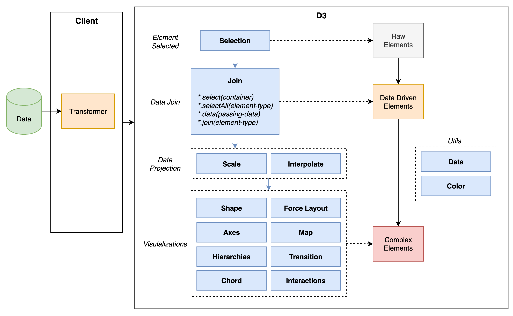

### 代码整洁之道：程序员的职业素养

在我看来，与问题本身的难度相比，解决问题的方式、步骤以及反思的程度，才能体现出一个人的职业素养。

---

在某些需要说“不”的场景中，可能的最好结果，是你和你的经理共同追求的目标。最关键的是要找到那个共同目标，而这往往有赖于协商。双方需要坐下来讨论预期冲突的产生原因以及潜在应对方案，前者用来重新梳理流程，后者用来面对客户。

---

**有时候，提供太多细节，只会招致更多的微观管理。**

---

**没有“试试看”这回事**。如果你此前并未有所保留，如果你没有新方案，如果你不会改变你的行为，如果你对自己原先的估计有充分的自信，那么，从本质上讲，承诺“尝试”就是一种不诚实的表现。你在说谎。你这么做的原因，可能是为了护住面子和避免冲突。

---

我发现，要精熟掌握每项技艺，关键都是要具备“信心”和“出错感知”能力。

---

代码必须能够帮你解决客户提出的问题。很多时候，客户提出的需求其实并没能真正解决他们自己的问题。这有赖于你去发现这些问题并与客户交流，以确保代码能够满足客户的真实需求。

### 面试框架

今天发呆的时候思考了一下目前使用的面试框架，发现实际上还是存在无效面试的问题。面试的主要目的在于区分候选人，所以实际上包含多个不同衡量指标，比如：技术能力、沟通能力、理解力、个人发展意愿与团队匹配性等等。

可以看到，单独某一个指标很难体现候选人的“可用性”，或者说仅专注于某一指标的面试流程并不能很好地体现候选人的综合能力。毕竟 “team work” 不是单纯的一问一答，而“八股文面试”便存在这个问题。在一个复杂环境中解决问题实际上需要多种能力的结合，这在候选人与公司的双向选择过程中需要尤其注意。有一些措施可以用来改进面试流程：

* 阅览候选人的博客、GitHub 等来了解他的代码习惯、学习能力；
* 基于候选人的既往项目经历来评估其综合能力（若有开源项目，可以让其尝试讲解某段代码）；
* 可以使用白板算法面试，但不局限于可运行代码，更多理解思路；
* 其他硬指标（工作年限、英语要求、技能匹配程度）可依情况变动。

### 闲聊

谁刨根问底掌握了细节，谁就是赢家。

### 前端 - D3

#### SVG 相关

* ***viewPort***：相当于显示器屏幕；
* ***viewBox***：相当于在屏幕上截取一小块，放大到整个屏幕窗口；
* ***preserveAspectRatio***：指定 viewBox 与 viewPort 的对齐方式和缩放方式。
  * <b><i>\<align\></b></i>：
    * none：不进行强制统一缩放；
    * x(Min|Mid|Max)Y(Min|Mid|Max)：参考实例 <b>[Demo](https://codepen.io/giodif/details/VYpaeo)</b>。
  * <b><i>\<meetOrSlice\></b></i>：
    * meet：保留宽高比、viewBox 在 viewPort 范围内可见、尽可能放大 viewbox；
    * slice：保留宽高比、viewPort 覆盖 viewBox、尽可能缩小 viewbox。

#### D3 API 架构（<b><i>[Playground](https://becavalier.github.io/d3-playground/)</i></b>）

